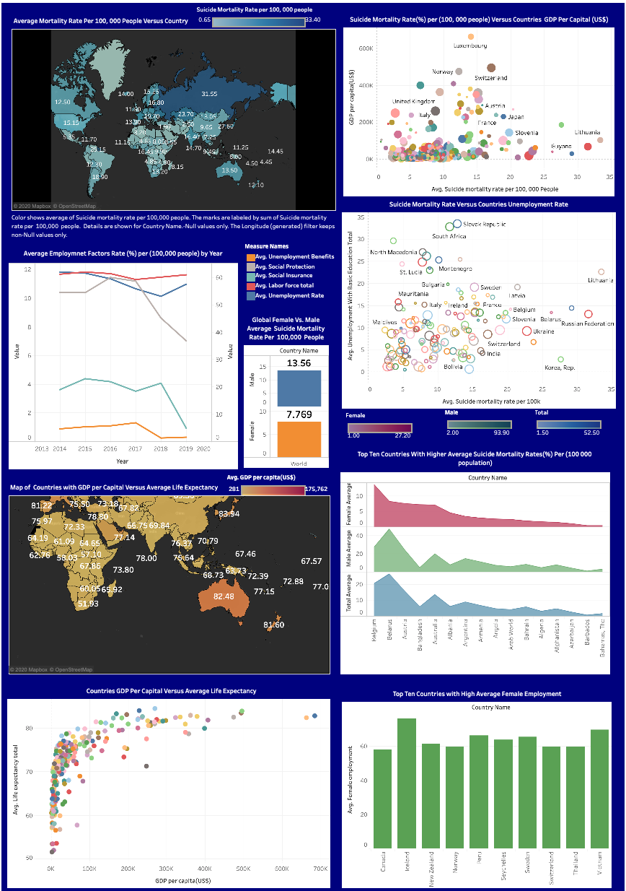

# Suicide Rates Prediction: Predicting Suicide Rates from Socio-Economic or Mental Health Risk Factors

## Background

Suicide rates, globally, have [increased]( https://github.com/QianyueMa/Google-Health-Search-Project) over the past decades, rising important public health burdens. Published statistics from the WHO indicates that about 800,000 people die of suicide every year, not to mention that how many more have attempted or idealized suicide in addition to that. 

Many causes that lead to the suicidal behaviour have been investigated, in terms of problem-solving deficits in the emergence of crises. **Primarily, there are two well-studied bodies of research on the suicide risk factors; one considers the structural and socio-economic factors, and the other considers the attributable psychiatric causes including mental disorders such as affective disorders and substance use disorders (Li et al., 2011).** It is assumed that if the policy makers in the governments could target their suicide prevention strategies on those two domains, the national suicide rates could potentially be lowered. Li and colleagues (2011) also found that by focusing the suicide prevention strategies on either of the two directions — the macro socio-economic factors or the mental health factors — the magnitudes of suicide -control effect could be similar in the population.

Therefore, considering the empirically established strong correlations between suicide attempts and people’s underlying mental health conditions or their socio-economic status (SES), our team believes it would be valuable **to study which personal and macroeconomic risk factors could predict the suicide rates on the national level and beyond**. In this project, we looked into both aspects. 

- - -

## Project Objectives
### Key Search Question

#### How to predict national suicide rates from the Socio-Economic or Mental Health risk factors

### Relevant factors of Interest

The **socio-economic factors** could include the following: demography, social stability, national economic development levels; GDP (or GDP per capita), the at-risk-of-poverty rates, the social inequality (e.g., in terms of race or gender), the level of employment versus joblessness (measured by Labour Force Participation Rate, Employment-to-Population Ratio, etc., to quality the labour market), the coverage of social insurance programs (% of population), the coverage of social protection and labor programs (% of population), the overall life expectancy, the population density, the age dependency ratio of the old or the young (% of working-age population), the societal or familial violence level (influenced by firearm availability, gender equality level, etc.), the overall education attainment, the low-socio-economic-status proportion of population, the insurance options and coverage, the internet broadband penetration, the public expenditures on the healthcare sector, etc. 

Also, we studied **the mental health factors in terms of mental health treatment accessibility**, should people need it. We specifically use the insights drawn from workplace surveys that are segmented into 3 clusters: **Demographics**, **Mental health services accessibility**, **Organizational cultures in the workplace in terms of openness about mental health**. The explanatory variables are primarily with regards to the burdens of seeking mental health services and the holistic conservativeness level about mental health issues in the workplace. The factors include level of fear of negative consequences in their workplace, observed/experienced negative consequences caused by disclosure, potential work interference, easiness to take a medical leave, easiness of discussing personal mental health issues among co-workers, insurance options for mental health care, welfare benefits offered by employers, size of the company, industry of their occupation, the availability of a wellness program, the history of seeking mental health treatments, and so on.

### Methodology & Main Objectives

We conduct **statistical analysis about various risk factors**, **perform a set of data visualizations**, and importantly, **build and test machine learning models**, in order to answer following **main questions**:

* Overall, what are the *strongest predictors for suicide* in different countries? Also, how to build **machine learning models* to study and predict our findings?

* In terms of the *macro economic-socio* factors, how do a country’s GDP/Income level average life expectancy, gender-specific fertility rate, education attainment, poverty rates, and other socio-economic and demographic factors affect the country’s annual suicide rates? What causes the differences in suicide rates among countries?
	* It is speculated that those mentioned national socio-economic factors determine the country’s holistic conservativeness level or attitude towards mental health topics. This attitude in turn can determine the government’s funding ratio on the mental health sector, as well as the severity of cultural stigma about mental illness. This then plays a larger role in contributing to people’s decision about whether or not seeking treatment for their illness will decrease their risk of suicide. 
	* Those findings are obtained from the [World Bank’s World Development Indicators](https://databank.worldbank.org/source/world-development-indicators) database. 

* On the *individual* level, how does the fact that a person had or has not sought for treatments influence their suicide risks? Also, why did they seek or not seek help for their mental health conditions? 
	* For example, the risk factors include the financial concerns (e.g., the insurance options offered, the company’s welfare packages), the fear of the consequences such as prejudice or employability if they disclose their mental health situations. **It should be noted that those microeconomic factors are largely tied up to their country’s general macroeconomic factors as well.**
	* Those insights are generated from the [OSMI Mental Health in Tech Survey]( https://www.kaggle.com/ekwiecinska96/mental-health-in-techology-survey-2014-and-2016). 

- - -

## Data Sources

Our project uses the insights generated from the [Mental Health in Tech Survey from Open Sourcing Mental Illness (OSMI)](https://www.kaggle.com/ekwiecinska96/mental-health-in-techology-survey-2014-and-2016) and the data from the [World Development Indicators database](https://databank.worldbank.org/source/world-development-indicators) in the World Bank. 
 
### Data Source 1
We have obtained the macro-socio-economic factors extracted from the [World Bank’s World Development Indicators database](https://databank.worldbank.org/source/world-development-indicators). This dataset looks into 246 countries of low- or middle- or high-income levels across the continents. 

The **selected factors** are shown [here](Data/raw_data/Data_Extract_From_World_Development_Indicators_metadata.csv).

In the in the New Composite Dataset, the `suicide mortality rate` is the dependent variable. The rest of the factors are independent variables. The `countries` is one of the key features.

### Data Source 2
The survey data from the [OSMI mental health in technology surveys](https://www.kaggle.com/ekwiecinska96/mental-health-in-techology-survey-2014-and-2016) is used to facilitate statistical analysis and to infer from its descriptive data representations. The dataset contains 27 factors. 

This is the detailed factor list *directly obtained* from this survey's [dataset notebook here](https://www.kaggle.com/osmi/mental-health-in-tech-survey/home):
 

- - -

## Architectural Diagram

## Deployment & Presentation
The APP is deployed in Heroku. To access the page, click the following [link](https://mindyourhealth.herokuapp.com/) to explore our whole project.

- https://mindyourhealth.herokuapp.com/

You can find our presentation [slide here](https://docs.google.com/presentation/d/1rNV9OyZRwMOkwW4LZzD71AB5QalhNDm-tOZPK2t0Pyc/edit)
- https://docs.google.com/presentation/d/1rNV9OyZRwMOkwW4LZzD71AB5QalhNDm-tOZPK2t0Pyc/edit

- - -

## Report: Data Visualization and Analysis Processes

## I. Exploratory Data Analysis
After we conducted data cleaning and loading, we conducted Exploratory Data Analysis and created dashboards by using Tableau. The Dashboards are shown below:

## II. Machine Learning Analysis
In this project, we used various machine learning models, trained and tested the data to see the models ability to predict suicide mortality rate from various macro socio-economic factors in the national level. We used linear regression, logistic regression, support Vector Machine, decision treem and random forest models. We note differences in accuracy and effectiveness the models have towards the entire dataset. We noticed similar reappearing patterns that we knew would serve some importance when predicting suicide mortality rate from various macro socio-economic factors.

### Data Pre-Processing
The first step in our analysis was to clean and pre-process our dataset to make ready for our machine learning analysis. We cleaned, explored and visualized the data, the pre-processing normalizes the data for the ML analysis.

Before the ML analysis we tried to see if there was any correlation between factors on Suicide mortality rate per 100,000 people.

In the correlation analysis we have found a positive (0.5) correlation between Suicide mortality rate, and coverage of social insurance programs.We have also found a negative(-0.5) correlation between suicide mortality rate and a percentage of the working population that possess basic education. Countries populated by people with a basic education negatively relate with the Suicide mortality rate. Which means that when more people join the education distribution, the suicide mortality rate decreases.

### Machine Learning Models

### Part One: Linear regression, Decision Tree Regression, Support Vector Regression (SVR)

The first three models we executed are linear regression, decision tree regression, and support vector regression (SVR) to estimate the suicide mortality rate (continuous dependent variable) on the estimator variables. The result from this three models showed that lower R-Squared value(R2), and higher mean square error(MSE). However, comparing the above three models decision tree regression explained the dependent variable(suicide mortality rate) better by the independent variable(predictor variables) with R-Squared value 0.24 and mean square error (MSE) 87.11.

[You can found the code here](https://github.com/ermiasgelaye/Mental-Health-Predictor/blob/master/machine_learning_analysis.ipynb)

### Part Two: Logistic Regression, Support Vector Machine, Decision Tree,Random Forest
To test the stated models we grouped our continuous dependent variable ("Suicide_mortality_rate_per_100k") into two groups, below and above the mean value (11.5). The suicide mortality rate above 11.5 would be high and below 11.5 would be low. Afterward we executed logistic regression, support Vector Machine, decision tree and random forest model.
The findings from these models showed that the models' accuracy to predict the dependent variable is low, however comparing the models support vector machine explains the data very well with a 0.69 accuracy.

## Conclusion
In conclusion, mental health and suicide are both important cases to study, because we continue to lose so many lives in this world at the hands of suicide. Our project focuses on identifying macro-level socio-economic factors that contribute to the problem. We believe that if socio-economic factors and polices towards mental health were changed, the issue would be solved easier. However, the issue is too complex and it all depends on the individuals' own experience, meaning a collaborative and comprehensive approach is necessary to address this issue. Specific to this project we faced many challenges with the data quality (so many null values), we hope that the models applied a better outlook to assist in seeing more factors that can predict the problem.
 - - -

## References:
* Ferretti, F., &amp; Coluccia, A. (2009). Socio-economic factors and suicide rates in European Union countries. *Legal Medicine, 11.* doi:10.1016/j.legalmed.2009.01.014
* Li, Z., Page, A., Martin, G., &amp; Taylor, R. (2011). Attributable risk of psychiatric and socio-economic factors for suicide from individual-level, population-based studies: A systematic review. *Social Science &amp; Medicine, 72*(4), 608-616. doi:10.1016/j.socscimed.2010.11.008
* National Alliance on Mental Health. (2013). Mental Health Conditions. Retrieved October 31, 2020, from https://www.nami.org/Learn-More/Mental-Health-Conditions
* Szanto, K. (2017). Cognitive Deficits: Underappreciated Contributors to Suicide. The American Journal of Geriatric Psychiatry, 25(6), 630-632. doi:10.1016/j.jagp.2017.02.012
* The World Bank, World Development Indicators (2020). Retrieved October 31, 2020, from https://databank.worldbank.org/source/world-development-indicators
* World Health Organization. (2020). Mental Health. Retrieved October 31, 2020, from https://www.who.int/health-topics/mental-health#tab=tab_2
* World Health Organization. (2019). Suicide. Retrieved October 31, 2020, from https://www.who.int/news-room/fact-sheets/detail/suicide
* World Health Organization. (2017). Depression and other common mental disorders: global health estimates. Retrieved October 31, 2020, from https://www.who.int/mental_health/management/depression/prevalence_global_health_estimates/en/
